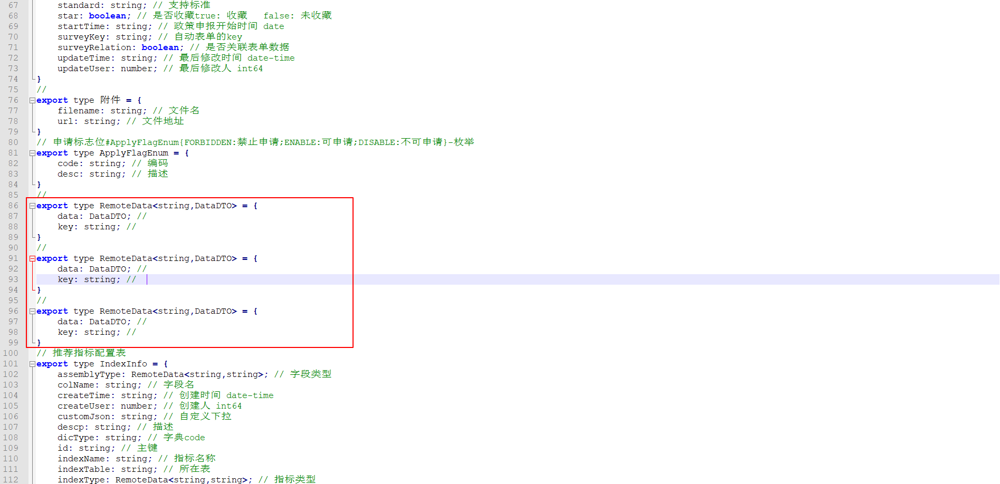

# 20230217

- 新建项目

# 20230221

- 使用typescript和webpack搭建项目框架

# 20230223

- 使用less与less-loader控制样式
- 从页面获取groupurl
- 使用订阅发布模式

# 20230226

- definitions解析方法

# 20230227

- 添加主页信息获取异常报错
- 新增右键菜单（菜单点击后的功能还没做）

# 20230228

- 添加右键菜单事件捕获
- apiManage类中添加专门处理接口的相关方法

# 20230301
- 支持右键对单一接口转化
- 支持复杂对象转化

# 20230303
- logo替换
- 转化当前页接口功能 抽离成一个函数
- 支持对delete接口的解析
- 支持 鼠标选中接口 进行转化
- 不在从主页dom中解析groupUrl，改为从接口中获取

# 20230304

- 鼠标选中接口转化 功能 添加兼容性代码
- 兼容 example 类型、schema类型UI页面

# 20230413
## 新增

- 添加put方法的支持

## bug修复

- 同一名称，不同 methods 类型接口 解析结果异常，总是解析成 delete method 的那个返回值

## 目前存在的问题

- 对象重复解析

如果某个对象中嵌套了多个对象，比如下面的 RemoteData，会导致最后生成多个RemoteData对象

# 20231028

- [x] fix: 适配 bootstrap-ui 仅只有 default 这个 分组 的情况

  

# 20231127

- [x] 添加新的 matchs 

  

解决这种类型的URL识别不出来的问题

http://IP:PORT/themeapi/doc.html#/home
