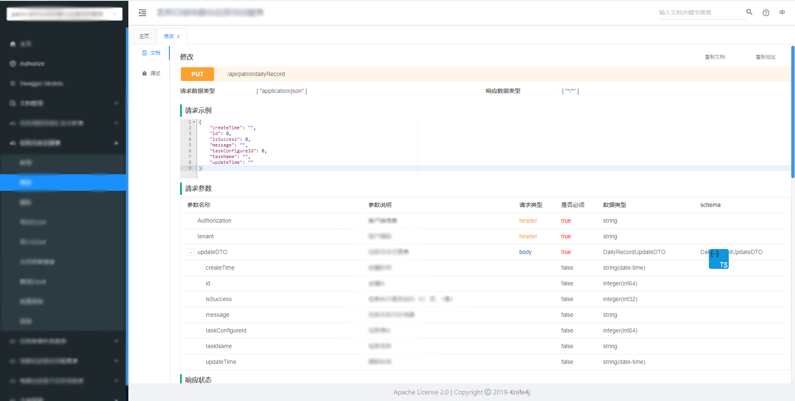
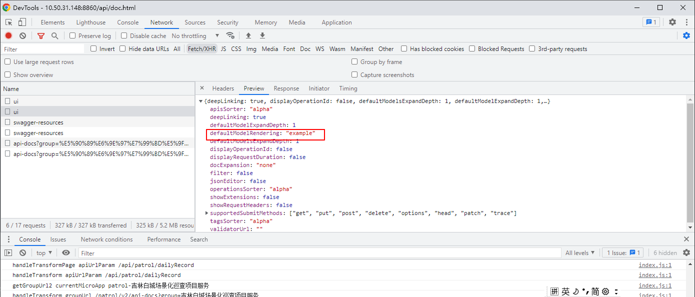
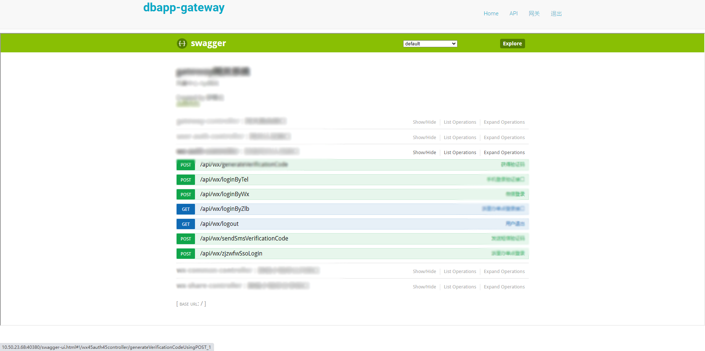
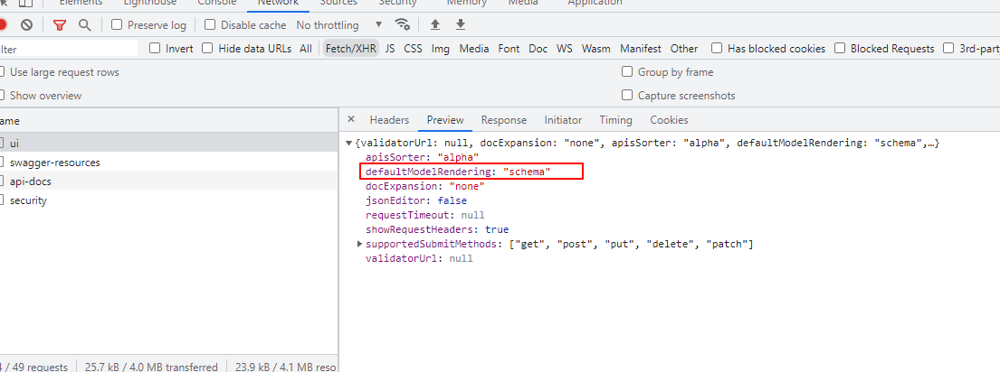
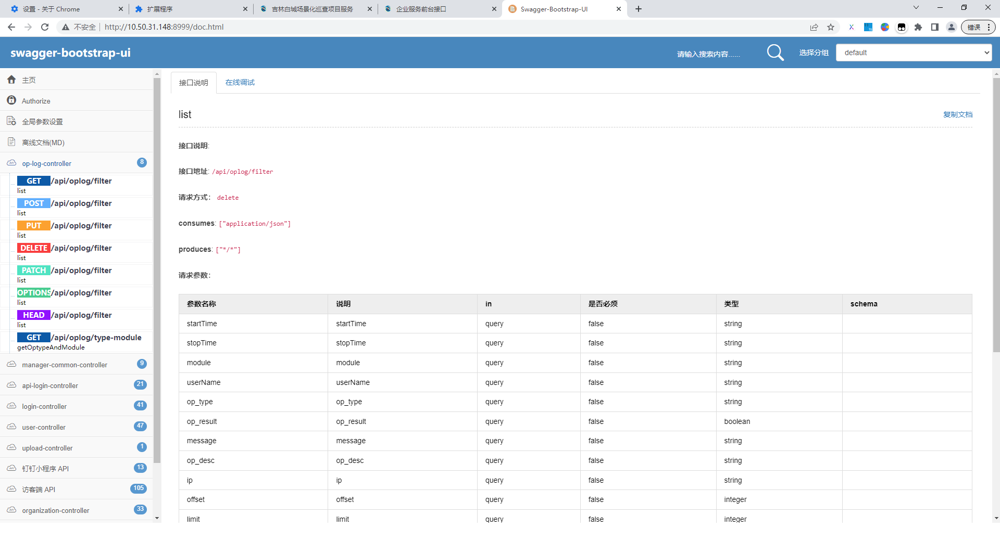

# 描述
用于将swagger转换成typescript文件的chrome扩展程序

# 适用范围

同时满足以下要求才可以使用

## swagger 版本是 2.0

## swagger 渲染类型

### swaggerUIConfig.defaultModelRendering = 'example'

### swaggerUIConfig.defaultModelRendering = 'schema'

### 不支持swagger-bootstrap-ui

目前 城市大脑预约审批系统 就是这种形式的 swagger

# 用来测试的 swagger 地址

[白城](http://10.50.31.148:8860/api/doc.html#/home)

[城市大脑](http://10.50.31.148:8999/doc.html)

[汉阳企业服务平台](http://10.50.23.68:40820/gateway/doc.html#)

账号：shuhan
密码：123456
账号2：yeyl
密码2：Ah@#12

[宁波创新积分](http://10.50.31.61:8003/doc.html#/)