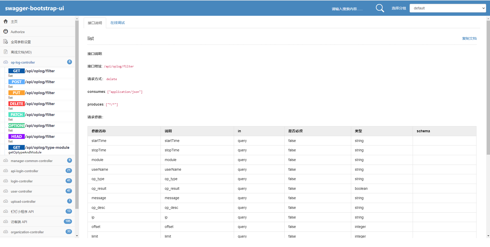

# 描述
用于将swagger转换成typescript文件的chrome扩展程序

# 适用范围

同时满足以下要求才可以使用

## swagger 版本是 2.0

## swagger 渲染类型

### swaggerUIConfig.defaultModelRendering = 'example'

### swaggerUIConfig.defaultModelRendering = 'schema'

### 不支持swagger-bootstrap-ui

目前 城市大脑预约审批系统 就是这种形式的 swagger

